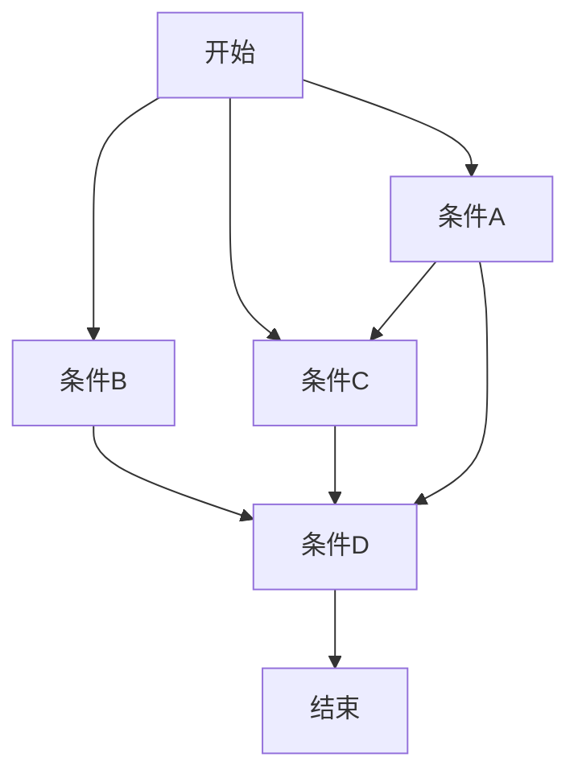
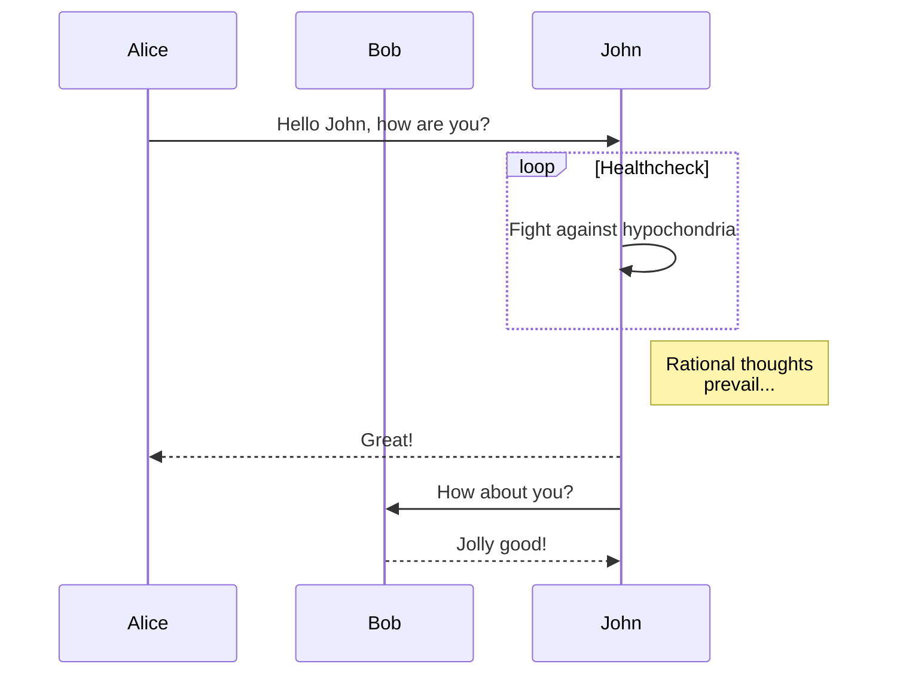
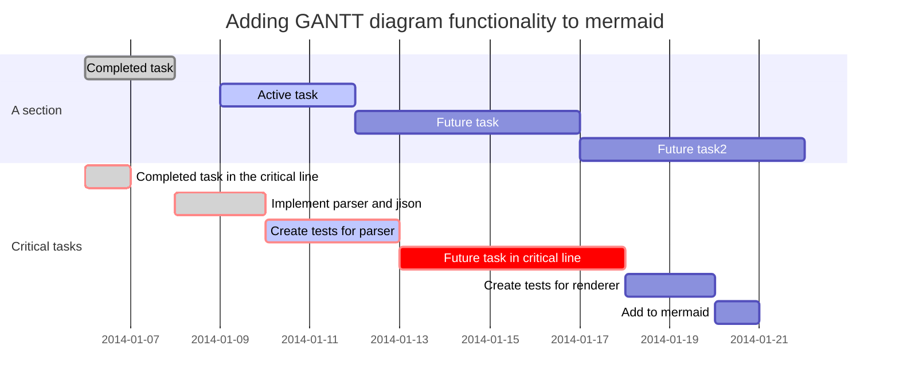
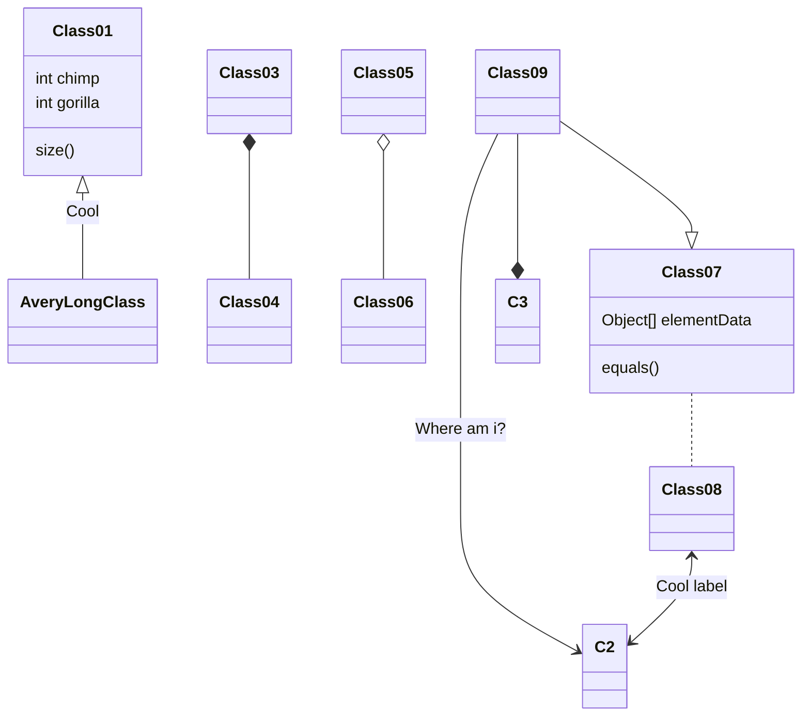

# Typora编辑器

# Typora 编辑器 ———— 书写即为美学

官方网站：[https://www.typora.io/](https://www.typora.io/)

支持平台：

 - Windows
 - Linux

特点：

* 完美支持 Github 的 Markdown 语法；
* 人性化的书写方式：
  * 表格的书写、挪动；
  * 图片，超链接，网页表格复制；
  * 目录生成；
* 支持 LeTex 公式书写；
* 支持 Flowchart，Mermaid 等流程图绘制；
* emoji，高亮，备注，上标，下标等书写；
* 生成网页，pdf，图片，甚至 word，LeTex 等格式。


## 基本的带快捷键的 Markdown 书写演示

`Ctrl 0` 到 `Ctrl 4`：普通文本、一级～四级标题；

`# head` 生成标题

`Ctrl B`：加粗，**加粗测试**；

`**bald**` 文本加粗

`Ctrl I`：斜体，*斜体测试*；

`*Italic*` 斜体

`Ctrl U`：下划线，<u>下划线测试</u>；

`Shift Alt 5`：删除线，~~删除线测试~~；

`~~line~~` 删除线

`Shift Ctrl Tab键上面那个键 `：行内代码块，`行内代码块测试`；

`Ctrl K`：超链接，[超链接测试](www.baidu.com)；还支持文章内锚点，请 `Ctrl ` 点击此处 :arrow_right: [第二节](#基本的不带快捷键 Markdown 书写演示)；

`Ctrl T`：表格，支持拖拽移动、网页端表格复制转换：

|   标题   | 数据一 | 数据二 |
| :------: | :----: | :----: |
| 表格测试 |  943   |  baka  |

`Ctrl Shift Q`：引用：

`>` 引用

> 我需要三件东西：爱情、友谊和图书。然而这三者之间何其相通！
>
> 炽热的爱情可以充实图书的内容，图书又是人们最忠实的朋友。
>
> —— 蒙田

`Shift Ctrl I`：图片：


`Shift Ctrl M`：公式块，快捷输入 LeTex 公式：

`&&formula&&` 输入公式
$$
Euler's identity: e^{i\pi}+1=0
$$

## 基本的不带快捷键 Markdown 书写演示

**部分功能需要现在配置文件中开启才能使用**

代码块（我居然不能转义那个字符，就 Tab 键上面那个）：

```python
#!/usr/bin/python3
import os
with open('List.txt', 'w') as f:
	for i in range(10):
		f.writelines(str(i))  
	print('成功写入数列')
os.system('rm ./List.txt')
print('成功删除文件')
```


无序、有序、任务列表：

- 酒石酸菌
- 玄墨之蝶

1. HTML
2. Python 3

- [x] 1.12.2 教程计划
- [x] Weblate 翻译计划
- [ ] All The Mods 3 实况计划


参考链接：

	通过培养试验研究了有机酸对铅、镉的毒害影响，结果表明柠檬酸对铅[^1]，酒石酸对镉有较明显解毒作用[^2]。用逐步提取法研究萝卜根叶内重金属存在的化学形态 ，有机酸处理并不影响各形态铅的优势顺序 ，但各形态铅的浓度或相对百分率发生了变化。

[^1]: 陈苏. 污染土壤中镉、铅的活化及植物有效性研究[D]. 中国科学院沈阳应用生态研究所, 2007.
[^2]: 陈英旭, 林琦, 陆芳,等. 有机酸对铅、镉植株危害的解毒作用研究[J]. 环境科学学报, 2000, 20(4):467-472.


上标下标：

```
上标：X^2^
下标：H~2~O
```

X^2^, H~2~O


高亮：

```
本节课重点：==第六、七章不考==，第三章出题较多，==平时分占 30%==
```

本节课重点：==第六、七章不考==，第三章出题较多，==平时分占 30%==


注释：

```
<!--这一段不要显示出来-->
```

<!--这一段不要显示出来-->


内联公式：

```
$e^{i\pi}+1=0$
```

$e^{i\pi}+1=0$


分割线：

```
---
```

我绝不会弃坑的！

----

:arrow_up: 上面的都是假话


emoji 图标：

```
:arrow_heading_down: :arrow_heading_up:
:ab: :blue_heart: :jack_o_lantern:
:ballot_box_with_check: :fork_and_knife:
```

:arrow_heading_down: :arrow_heading_up:
:ab: :blue_heart: :jack_o_lantern:
:ballot_box_with_check: :fork_and_knife:


目录生成：

```
[toc]
```

[TOC]

# Markdown 拓展功能

HTML 原生支持，目前只支持 img 标签，用以自定义图片大小和缩放：

```
</img>
```

</img>


LaTex 公式支持，包括 mhchem，AMSmath，BBox：

mhchem：
$$
\ce{SO4^2- + Ba^2+ -> BaSO4 v}
$$
BBox：
$$
\bbox[5px,border:2px solid red]{AB^2 +AC^2 = BC^2}
$$


流程图支持，内置了 Flowchart，Sequence，Mermaid 引擎，支持多种多样的流程图、时序图、甘特图：

- 流程图（Flowchart）

```flow
st=>start: Start:>http://www.google.com[blank]
e=>end:>http://www.google.com
op1=>operation: My Operation
sub1=>subroutine: My Subroutine
cond=>condition: Yes
or No?:>http://www.google.com
io=>inputoutput: catch something...

st->op1->cond
cond(yes)->io->e
cond(no)->sub1(right)->op1
```


- 流程图（Mermaid）



- 时序图（Mermaid）



- 时序图（Sequence）

```sequence
Alice->>John: Hello John, how are you?
Note right of John: Rational thoughts
John-->>Alice: Great!
John->>Bob: How about you?
Bob-->>John: Jolly good!
```

- 甘特图（Mermaid）



---

- 其他 Mermaid 图（目前还有点问题，不建议使用）
- Class diagram



- Git


## 主题替换

访问：[http://theme.typora.io/](http://theme.typora.io/)

## 文章导出

- 图片（非常适合手机阅读）
- PDF
- HTML（可选择是否带样式表）
- 其他需要第三方库支持
